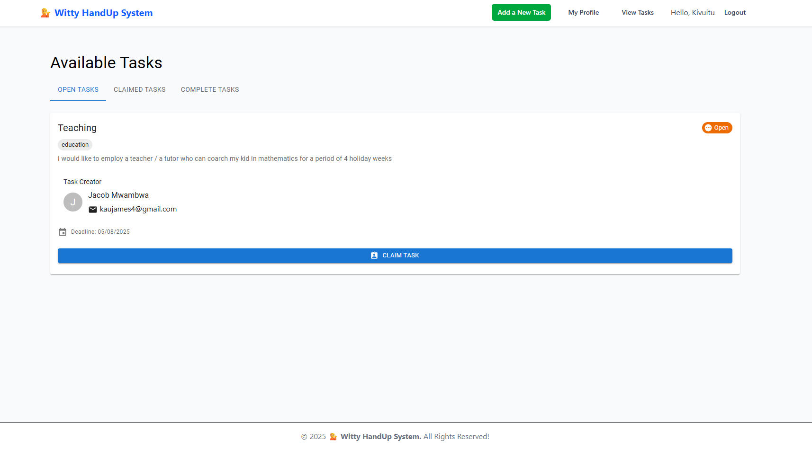
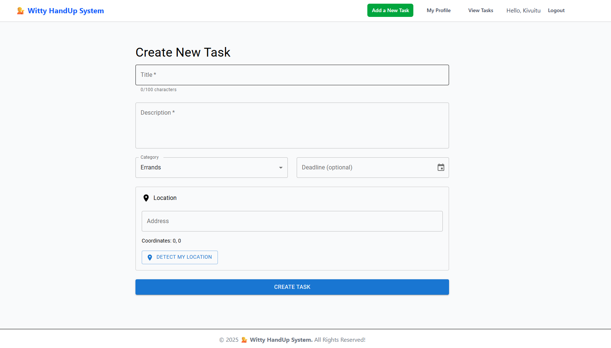
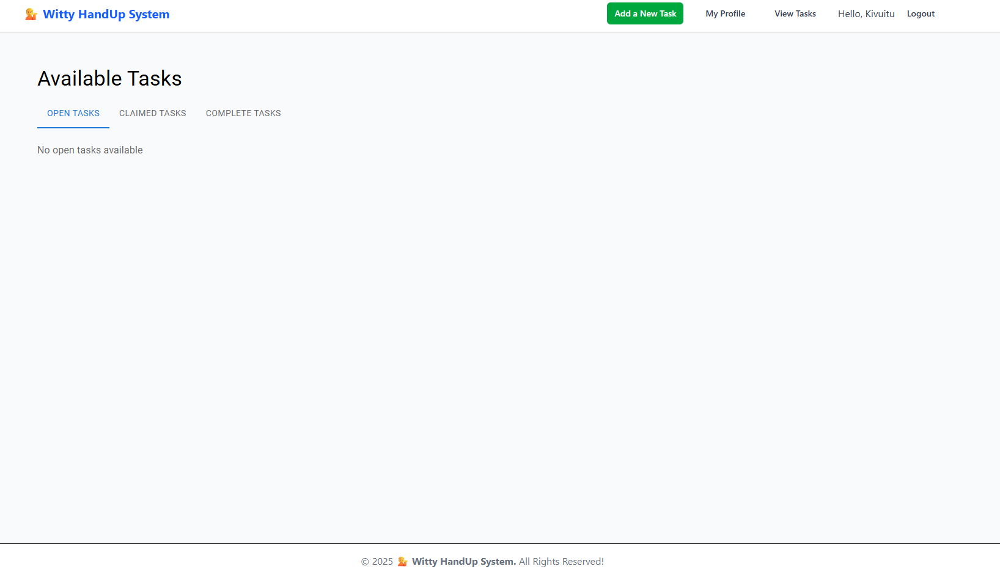
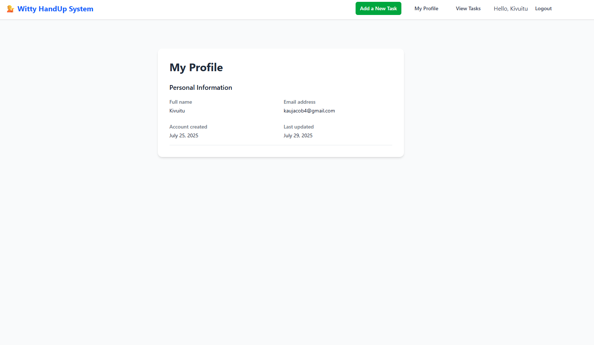
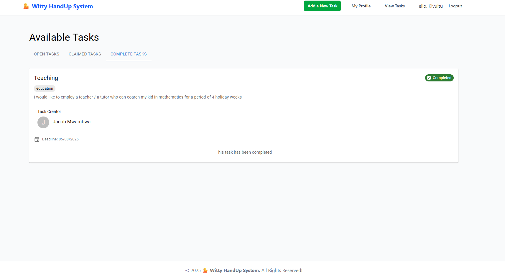
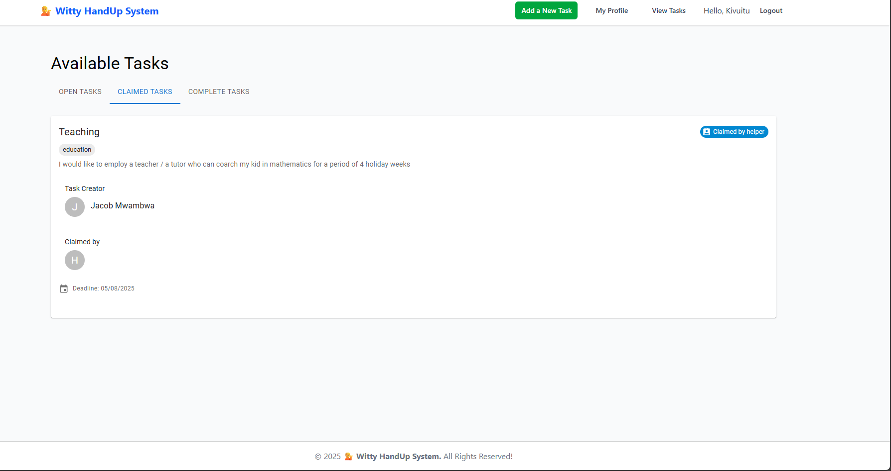

# **💁 Witty HandUp - Task Management System**  

## **📖 Table of Contents**  
1. [Project Overview](#-project-overview)  
2. [Features](#-features)  
3. [Tech Stack](#-tech-stack)  
4. [Installation & Setup](#-installation--setup)  
5. [API Documentation](#-api-documentation)  
6. [Testing](#-testing)  
7. [CI/CD Pipeline](#-cicd-pipeline)  
8. [Troubleshooting](#-troubleshooting)  
9. [Future Improvements](#-future-improvements)  

---

## **🌍 Project Overview**  
**Witty HandUp** is a community-driven task management platform where users can:  
- **Post tasks** they need help with (errands, repairs, education, etc.).  
- **Claim tasks** posted by others.  
- **Track task status** (Open → Claimed → Completed).  
- **Communicate** with task creators/helpers via contact info.  

Built with **MERN Stack (MongoDB, Express.js, React, Node.js)** + **Material-UI**.  

---

## **✨ Features**  
### **🔹 User Roles & Task Flow**  
| Role | Actions |
|------|---------|
| **Requester** | Create, Edit, Delete tasks |
| **Helper** | Claim & Complete tasks |
| **All Users** | View tasks, filter by location |

### **🔹 Task Status**  
- **🟡 Open** – Available for claiming  
- **🔵 Claimed** – Taken by a helper  
- **🟢 Completed** – Finished  

### **🔹 Key Functionalities**  
✅ **Real-time updates** (task status changes)  
✅ **Location-based task filtering** (10km radius)  
✅ **User profiles with contact info** (email)  
✅ **Responsive UI** (works on mobile & desktop)  

---

## **💻 Tech Stack**  
### **Backend**  
- **Node.js** (Runtime)  
- **Express.js** (API Framework)  
- **MongoDB** (Database)  
- **Mongoose** (ODM)  
- **JWT** (Authentication)  

### **Frontend**  
- **React.js** (UI Framework)  
- **Material-UI** (Styling)  
- **React Router** (Navigation)  
- **Axios** (API Calls)  

### **DevOps & Testing**  
- **Jest** (Unit/Integration Tests)  
- **GitHub Actions** (CI/CD)  
- **Docker** (Containerization)  

---

## **⚙️ Installation & Setup**  

### **1. Backend Setup**  
```bash
cd backend
npm install
cp .env.example .env  # Configure MongoDB & JWT keys
npm run dev  # Start dev server (http://localhost:5000)
```

### **2. Frontend Setup**  
```bash
cd frontend
npm install
cp .env.example .env  # Set API base URL
npm start  # Runs on http://localhost:5173
```

### **3. Database Setup**  
- MongoDB Atlas (cloud) or local MongoDB instance.  
- Update `backend/.env` with your `MONGODB_URI`.  

---

## **📡 API Documentation**  

### **🔹 Task Endpoints**  
| Method | Endpoint | Description |
|--------|----------|-------------|
| `GET` | `/api/tasks` | Get all tasks (open + claimed) |
| `POST` | `/api/tasks` | Create new task |
| `PUT` | `/api/tasks/:id/claim` | Claim a task |
| `PUT` | `/api/tasks/:id/complete` | Mark as completed |
| `DELETE` | `/api/tasks/:id` | Delete a task |

### **🔹 User Authentication**  
| Method | Endpoint | Description |
|--------|----------|-------------|
| `POST` | `/api/auth/register` | Register new user |
| `POST` | `/api/auth/login` | Login & get JWT token |

📌 **Full API Docs:** [Postman Collection](https://documenter.getpostman.com/view/123456/WittyHandUp-API)  

---

## **🧪 Testing**  

### **1. Backend Tests**  
```bash
cd backend
npm test  # Runs Jest tests
```

**Test Coverage:**  
- Task creation & claiming  
- User authentication  
- Error handling  

### **2. Frontend Tests**  
```bash
cd frontend
npm test  # Runs React Testing Library
```

**Tested Components:**  
- TaskCard (renders correctly for each status)  
- TaskForm (validation & submission)  

---

## **🚀 CI/CD Pipeline**  

### **GitHub Actions Workflow**  
- **On `push` to `main`:**  
  ✅ Run backend & frontend tests  
  ✅ Build Docker containers  
  ✅ Deploy to AWS (if tests pass)  

### **Docker Setup**  
```dockerfile
# backend/Dockerfile
FROM node:16
WORKDIR /app
COPY package*.json ./
RUN npm install
COPY . .
EXPOSE 5000
CMD ["npm", "run", "start"]
```

```bash
docker-compose up --build  # Runs full app (frontend + backend + DB)
```

---

## **🛠 Troubleshooting**  

### **🔹 Common Issues**  
| Problem | Solution |
|---------|----------|
| Tasks not showing after claiming | Check backend `getTasks` includes `claimed` status |
| Helper info missing | Ensure `populate("helper")` in API response |
| Location filter not working | Verify MongoDB `2dsphere` index exists |

### **🔹 Debugging Tips**  
1. **Check API responses** in browser DevTools (Network tab).  
2. **Log task data** in `TaskCard.jsx`:  
   ```js
   console.log("Task Data:", task);
   ```
3. **Test API manually** with Postman.  

---

## **🔮 Future Improvements**  
- **Real-time chat** between users  
- **Task categories & search**  
- **User ratings & reviews**  
- **Push notifications**  

---

## **🎯 Conclusion**  
Witty HandUp simplifies task delegation in communities. With **secure auth**, **real-time updates**, and **location-based filtering**, it’s a robust solution for local assistance.  

**🚀 Happy Helping!**  

📌 **GitHub Repo:** [https://github.com/jacobkau/HandUp.git](https://github.com/jacobkau/HandUp.git)  
📧 **Contact:** [mailto:kaujacob4@gmail.com](kaujacob4@gmail.com)  

--- 

## 📸 Screenshots Gallery

<p align="center">
  
  
  
</p>
<p align="center">
  
  
  
</p>

--- 

## 🌍 Live Demo
**Backend**
🔗 [Witty HandUp Live on Render](https://handup.onrender.com)

**Frontend**
🔗 [Witty HandUp Live on Vercel](https://wittyhandupsystem.vercel.app/)

## 🎥 Video Demo

📺 [Watch the full walkthrough on YouTube](https://youtu.be/43tpj-NikrY)
--- 


### **License**  
MIT © 2023 Witty HandUp Team
